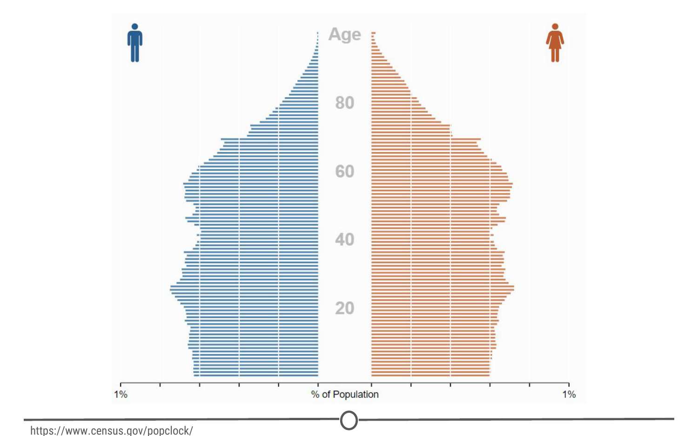

# What is data science?

Data science can involve:

- Statistics, computer science, mathematics

- Data cleaning and formatting

- Data visualization

An Economist Special Report sums up this melange of skills well - they state that a data scientist is broadly defined as someone:

> “who combines the skills of software programmer, statistician and storyteller slash artist to extract the nuggets of gold hidden under mountains of data”

### Why do we need data science?

One of the reasons for the rise of data science in recent years is the vast amount of data currently available and being generated. Not only are massive amounts of data being collected about many aspects of the world and our lives, but we simultaneously have the rise of inexpensive computing. This has created the perfect storm in which we have rich data and the tools to analyse it: Rising computer memory capabilities, better processors, more software and now, more data scientists with the skills to put this to use and answer questions using this data!

There is a little anecdote that describes the truly exponential growth of data generation we are experiencing. In the third century BC, the Library of Alexandria was believed to house the sum of human knowledge. Today, there is enough information in the world to give every person alive 320 times as much of it as historians think was stored in Alexandria’s entire collection.

And that is still growing.

### What is big data?

We’ll talk a little bit more about big data in a later lecture, but it deserves an introduction here - since it has been so integral to the rise of data science. There are a few qualities that characterize big data. The first is volume. As the name implies, big data involves large datasets - and these large datasets are becoming more and more routine. For example, say you had a question about online video - well, YouTube has approximately 300 hours of video uploaded every minute! You would definitely have a lot of data available to you to analyse, but you can see how this might be a difficult problem to wrangle all of that data!

And this brings us to the second quality of big data: velocity. Data is being generated and collected faster than ever before. In our YouTube example, new data is coming at you every minute! In a completely different example, say you have a question about shipping times or routes. Well, most transport trucks have real time GPS data available - you could in real time analyse the trucks movements… if you have the tools and skills to do so!

The third quality of big data is variety. In the examples I’ve mentioned so far, you have different types of data available to you. In the YouTube example, you could be analysing video or audio, which is a very unstructured data set, or you could have a database of video lengths, views or comments, which is a much more structured dataset to analyse.

### What is a data scientist?
So we’ve talked about what data science is and what sorts of data it deals with, but something else we need to discuss is what exactly a data scientist is.

The most basic of definitions would be that a data scientist is somebody who uses data to answer questions. But more importantly to you, what skills does a data scientist embody?

And to answer this, we have this illustrative Venn diagram, in which data science is the intersection of three sectors - Substantive expertise, hacking skills, and math and statistics.

To explain a little on what we mean by this, we know that we use data science to answer questions - so first, we need to have enough expertise in the area that we want to ask about in order to formulate our questions and to know what sorts of data are appropriate to answer that question. Once we have our question and appropriate data, we know from the sorts of data that data science works with, often times it needs to undergo significant cleaning and formatting - and this often takes computer programming slash “hacking” skills. Finally, once we have our data, we need to analyse it, and this often takes math and stats knowledge.

In this specialization, we’ll spend a bit of time focusing on each of these three sectors, but will primarily focus on math and statistics knowledge and hacking skills. For hacking skills, we’ll focus on teaching two different components: computer programming or at least computer programming with R, which will allow you to access data, play around with it, analyze it, and plot it. Additionally, we’ll focus on having you learn how to go out and get answers to your programming questions.

One reason data scientists are in such demand is that most of the answers aren’t already outlined in textbooks - a data scientist needs to be somebody who knows how to find answers to novel problems.

# What is data?

Since we’ve spent some time discussing what data science is, we should spend some time looking at what exactly data is.

### Definitions of “data”

First, let’s look at what a few trusted sources consider data to be.

First up, we’ll look at the Cambridge English Dictionary, which states that data is:

> Information, especially facts or numbers, collected to be examined and considered and used to help decision-making.

Second, we’ll look at the definition provided by Wikipedia, which is:

> A set of values of qualitative or quantitative variables.

These are slightly different definitions and they get at different components of what data is. Both agree that data is values or numbers or facts, but the Cambridge definition focuses on the actions that surround data - data is collected, examined and most importantly, used to inform decisions. We’ve focused on this aspect before - we’ve talked about how the most important part of data science is the question and how all we are doing is using data to answer the question. The Cambridge definition focuses on this.

The Wikipedia definition focuses more on what data entails. And although it is a fairly short definition, we’ll take a second to parse this and focus on each component individually.

So, the first thing to focus on is **“a set of values”** - to have data, you need a set of items to measure from. In statistics, this set of items is often called the population. The set as a whole is what you are trying to discover something about. For example, that set of items required to answer your question might be all websites or it might be the set of all people coming to websites, or it might be a set of all people getting a particular drug. But in general, it’s a set of things that you’re going to make measurements on.

The next thing to focus on is **“variables”** - variables are measurements or characteristics of an item. For example, you could be measuring the height of a person, or you are measuring the amount of time a person stays on a website. On the other hand, it might be a more qualitative characteristic you are trying to measure, like what a person clicks on on a website, or whether you think the person visiting is male or female.

Finally, we have both **qualitative and quantitative** variables. Qualitative variables are, unsurprisingly, information about qualities. They are things like country of origin, sex, or treatment group. They’re usually described by words, not numbers, and they are not necessarily ordered. Quantitative variables on the other hand, are information about quantities. Quantitative measurements are usually described by numbers and are measured on a continuous, ordered scale; they’re things like height, weight and blood pressure.

So, taking this whole definition into consideration we have measurements (either qualitative or quantitative) on a set of items making up data - not a bad definition.

### What can data look like? (rarely)

When we were going over the definitions, our examples of variables and measurements (country of origin, sex, height, weight) are pretty basic examples; you can easily envision them in a nice looking spreadsheet, with individuals along one side of the table, and the information for those variables along the other side.

Unfortunately, this is rarely how data is presented to you. The data sets we commonly encounter are much messier, and it is our job to extract the information we want, corral it into something tidy like the imagined table above, analyse it appropriately, and often, visualize our results.

### More common types of messy data

Here are just some of the data sources you might encounter and we’ll briefly look at what a few of these data sets often look like or how they can be interpreted, but one thing they have in common is the messiness of the data - you have to work to extract the information you need to answer your question.

- Sequencing data

- Population census data

- Electronic medical records (EMR), other large databases

- Geographic information system (GIS) data (mapping)

- Image analysis and image extrapolation

- Language and translations

- Website traffic

- Personal/Ad data (eg: Facebook, Netflix predictions, etc)

### Messy data: Sequencing

One type of data, that I work with regularly, is sequencing data. This data is generally first encountered in the FASTQ format, the raw file format produced by sequencing machines. These files are often hundreds of millions of lines long, and it is our job to parse this into an understandable and interpretable format and infer something about that individual’s genome. In this case, this data was interpreted into expression data, and produced a plot called a “volcano plot”.

### Messy data: Census information

One rich source of information is country wide censuses. In these, almost all members of a country answer a set of standardized questions and submit these answers to the government. When you have that many respondants, the data is large and messy; but once this large database is ready to be queried, the answers embedded are important.Here we have a very basic result of the last US census - in which all respondants are divided by sex and age, and this distribution is plotted in this population pyramid plot.

Here is the US census website and some tools to help you examine it, but if you aren’t from the US, I urge you to check out your home country’s census bureau (if available) and look at some of the data there!

### Messy data: Electronic medical records (EMR)

Electronic medical records are increasingly prevalent as a way to store health information, and more and more population based studies are using this data to answer questions and make inferences about populations at large, or as a method to identify ways to improve medical care. For example, if you are asking about a population’s common allergies, you will have to extract many individuals’ allergy information, and put that into an easily interpretable table format where you will then perform your analysis.

### Messy data: Image analysis/extrapolation

A more complex data source to analyse are images/videos. There is a wealth of information coded in an image or video, and it is just waiting to be extracted. An example of image analysis that you may be familiar with is when you upload a picture to Facebook and not only does it automatically recognize faces in the picture, but then suggests who they may be. A fun example you can play with is the DeepDream software that was originally designed to detect faces in an image, but has since moved on to more artistic pursuits.

There is another fun Google initiative involving image analysis, where you help provide data to Google’s machine learning algorithm… by doodling!

Data is of secondary importance
Recognizing that we’ve spent a lot of time going over what data is, we need to reiterate - Data is important, but it is secondary to your question. A good data scientist asks questions first and seeks out relevant data second.

Admittedly, often the data available will limit, or perhaps even enable, certain questions you are trying to ask. In these cases, you may have to reframe your question or answer a related question, but the data itself does not drive the question asking.

### Summary

In this lesson we focused on data - both in defining it and in exploring what data may look like and how it can be used.

First, we looked at two definitions of data, one that focuses on the actions surrounding data, and another on what comprises data. The second definition embeds the concepts of populations, variables, and looks at the differences between quantitative and qualitative data.

Second, we examined different sources of data that you may encounter, and emphasized the lack of tidy datasets. Examples of messy datasets, where raw data needs to be wrangled into an interpretable form, can include sequencing data, census data, electronic medical records, etc. And finally, we return to our beliefs on the relationship between data and your question and emphasize the importance of question-first strategies. You could have all the data you could ever hope for, but if you don’t have a question to start, the data is useless.

# Getting help

One of the main skills you are going to be called upon for as a data scientist is your ability to solve problems. And sometimes to do that, you need help. The ability to solve problems is at the root of data science; so the importance of being able to do so is paramount. In this lesson, we are going to equip you with some strategies to help you when you get stuck with a problem and need some help! Much of this information has been compiled from Roger Peng’s video on “Getting Help” and Eric Raymond’s “How to ask questions the smart way” - so definitely check out those resources!

### Why is knowing how to get help important?

Being able to solve problems is often one of the core skills of a data scientist. Data science is new; you may be the first person to come across a specific problem and you need to be equipped with skills that allow you to tackle problems that are both new to you and to the community!

Finally, troubleshooting and figuring out solutions to problems is a great, transferable skill! It will serve you well as a data scientist, but so much of what any job often entails is problem solving. Being able to think about problems and get help effectively is of benefit to you in whatever career path you find yourself in!

### Before you ask for help

Before you begin asking others for help on your problem, there are a few steps you can take on your own. Oftentimes, the fastest answer is one you find for yourself.

One of your first stops for data analysis problems should be reading the manuals or help files (for R problems, try typing ?command) – if you post a question on a forum that is easily answered by the manual, you will often get a reply of “Read the manual” … which is not the easiest way to get at the answer you were going for!

Next steps are searching on Google and searching relevant forums. Common forums for data science problems include StackOverflow and CrossValidated. Additionally, for you in this class, there is a course forum that is a great resource and super helpful! Before posting a question to any forum, try and double check that it hasn’t been asked before, using the forums’ search functions.

While you are Googling, things to pay attention to and look for are: tutorials, FAQs, or vignettes of whatever command or program is giving you trouble. These are great resources to get you started – either in telling you the language/words to use in your next searches, or outright showing you how to do something.

### First steps for solving coding problems

As you get further into this course and using R, you may run into coding problems and errors and there are a few strategies you should have ready to deal with these. In my experience, coding problems generally fall into two categories: your command produces no data and spits out an error message OR your command produces an output, but it is not at all what you wanted. These two problems have different strategies for dealing with them.

If it’s a problem producing an error message:

- Check for typos!

- Read the error message and make sure you understand it

- Google the error message, exactly

I’ve been there – you type out a command and all you get are lines and lines of angry red text telling you that you did something wrong. And this can be overwhelming. But taking a second to check over your command for typos and then carefully reading the error message solves the problem in nearly all of the cases. The error messages are there to help you – it is the computer telling you what went wrong. And when all else fails, you can be pretty assured that somebody out there got the same error message, panicked and posted to a forum – the answer is out there.

On the other hand, if you get an output, but it isn’t what you expected:

- Consider how the output was different from what you expected

- Think about what it looks like the command actually did, why it would do that, and not what you wanted

Most problems like this are because the command you provided told the program to do one thing and it did that thing exactly… it just turns out what you told it to do wasn’t actually what you wanted! These problems are often the most frustrating – you are so close but so far! The quickest way to figuring out what went wrong is looking at the output you did get, comparing it to what you wanted, and thinking about how the program may have produced that output instead of what you wanted. These sorts of problems give you plenty of practice thinking like a computer program!

### Next steps

Alright, you’ve done everything you are supposed to do to solve the problem on your own – you need to bring in the big guns now: other people!

Easiest is to find a peer with some experience with what you are working on and ask them for help/direction. This is often great because the person explaining gets to solidify their understanding while teaching it to you, and you get a hands on experience seeing how they would solve the problem. In this class, your peers can be your classmates and you can interact with them through the course forum (double check your question hasn’t been asked already!).

But, outside of this course, you may not have too many data science savvy peers – what then?

“Rubber duck debugging” is a long held tradition of solitary programmers everywhere. In the book “The Pragmatic Programmer,” there is a story of how stumped programmers would explain their problem to a rubber duck, and in the process of explaining the problem, identify the solution.

Wikipedia explains it well:

> Many programmers have had the experience of explaining a programming problem to someone else, possibly even to someone who knows nothing about programming, and then hitting upon the solution in the process of explaining the problem. In describing what the code is supposed to do and observing what it actually does, any incongruity between these two becomes apparent.

So next time you are stumped, bring out the bath toys!

### When all else fails: posting to forums

You’ve done your best. You’ve searched and searched. You’ve talked with peers. You’ve done everything possible to figure it out on your own. And you are still stuck. It’s time. Time to post your question to a relevant forum.

Before you go ahead and just post your question, you need to consider how you can best ask your question to garner (helpful) answers.

How to effectively ask questions on forums
**Details to include:**

- The question you are trying to answer

- How you approached the problem, what steps you have already taken to answer the question

- What steps will reproduce the problem (including sample data for troubleshooters to work from!)

- What was the expected output

- What you saw instead (including any error messages you received!)

- What troubleshooting steps you have already tried

- Details about your set-up, eg: what operating system you are using, what version of the product you have installed (eg: R, Rpackages)

- Be specific in the title of your questions!

### How to title forum posts

Most of these details are self-explanatory, but there can be an art to titling your posting. Without being specific, you don’t give your potential helpers a lot to go off of – they don’t really know what the problem is and if they are able to help you.

**Bad:**

- HELP! Can’t fit linear model!

- HELP! Don’t understand PCA!

These titles don’t give your potential helpers a lot to go off of – they don’t really know what the problem is and if they are able to help you. Instead, you need to provide some details about what you are having problems with. Answering what you were doing and what the problem is are two key pieces of information that you need to provide. This way somebody who is on the forum will know exactly what is happening and that they might be able to help!

**Better:**

- R 3.4.3 lm() function produces seg fault with large data frame (Windows 10)

- Applied PCA to a matrix - what are U, D, and Vt?

**Even better:**

- R 3.4.3 lm() function on Windows 10 – seg fault on large dataframe

- Using principle components to discover common variation in rows of a matrix, should I use, U, D or Vt?

- Use titles that focus on the very specific core problem that you are trying to get help with. It signals to people that you are looking for a very specific answer; the more specific the question, often, the faster the answer.

### Forum etiquette
Following a lot of the tips above will serve you well in posting on forums and observing forum etiquette. You are asking for help, you are hoping somebody else will take time out of their day to help you – you need to be courteous. Often this takes the form of asking specific questions, doing some troubleshooting of your own, and giving potential problem solvers easy access to all the information they need to help you. Formalizing some of these do’s and don’t’s, you get the following lists:

**Do’s:**

- Read the forum posting guidelines

- Make sure you are asking your question on an appropriate forum!

- Describe the goal

- Be explicit and detailed in your explanation

- Provide the minimum information required to describe (and replicate) the problem

- Be courteous! (Please and thank you!)

- Follow up on the post OR post the solution

Let’s take a few seconds to talk a bit about this last point, as we have touched on the others already. First, what do we mean by “follow up on the post”? You’ve asked your question and you’ve received several answers and lo and behold one of them works! You are all set, get back to work! No! Go back to your posting, reply to the solution that worked for you, explaining that they fixed your problem and thanking them for their solution! Not only do the people helping you deserve thanks, but this is helpful to anybody else who has the same problem as you, later on. They are going to do their due diligence, search the forum and find your post – it is so helpful for you to have flagged the answer that solved your problem.

Conversely, while you are waiting for a reply, perhaps you stumble upon the solution (go you!) – don’t just close the posting or never check back on it. One, people who are trying to help you may be replying and you are functionally ignoring them, or two, if you close it with no solution, somebody with the same problem won’t ever learn what your solution was! Make sure to post the solution and thank everybody for their help!

**Don’t’s:**

- Immediately assume you have found a bug

- Post homework questions

- Cross post on multiple forums

- Repost if you don’t immediately get a response

These are all pretty clear guidelines. Nobody wants to help somebody who assumes that the root cause of the problem isn’t because they have made a mistake, but that there is something wrong with a program. Spoiler alert, it’s (almost) always because you made a mistake. Similarly, nobody wants to do your homework for you, they want to help somebody who is genuinely trying to learn – not find a short cut.

Additionally, for people who are active on multiple forums, it is always aggravating when the same person posts the same question on five different forums…. Or when the same question is posted on the same forum repeatedly. Be patient – pick the most relevant forum for your purposes, post once, and wait.

### Summary

In this lesson, we look at how to effectively get help when you run into a problem. This is important for your future as a data scientist!

We first looked at strategies to use before asking for help, including reading the manual, checking the help files, and searching Google and appropriate forums. We also covered some common coding problems you may face and some preliminary steps you can take on your own, including paying special attention to error messages and examining how your code behaved compared to your goal.

Once you’ve exhausted these options, we turn to other people for help. We can ask peers for help or explain our problems to our trusty rubber ducks (be it an actual rubber duck or an unsuspecting coworker!). Our course forum is also a great resource for you all to talk with many of your peers! Go introduce yourself!

And if all else fails, we can post on forums (be it in this class or at another forum, like StackOverflow), with very specific, reproducible questions. Before doing so, be sure to brush up on your forum etiquette - it never hurt anybody to be polite! Be a good citizen of our forums!

There is an art to problem solving, and the only way to get practice is to get out there and start solving problems! Get to it!
