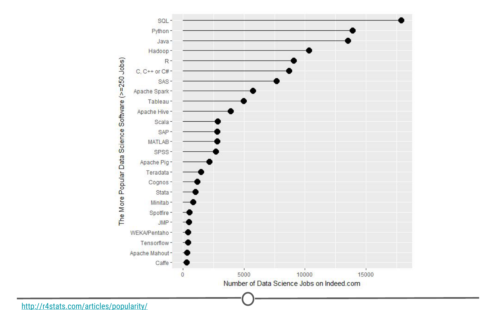
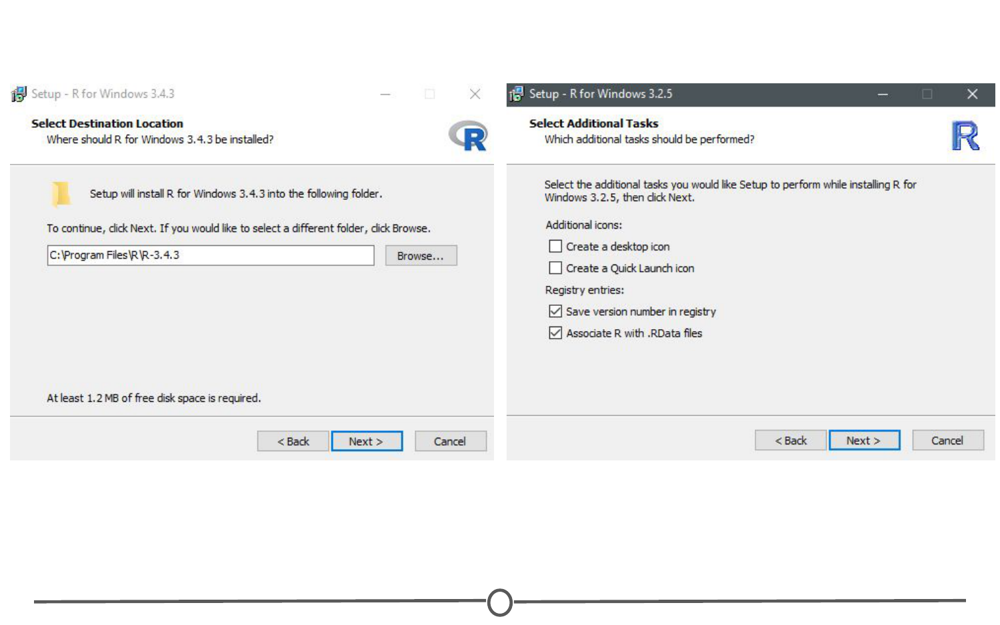
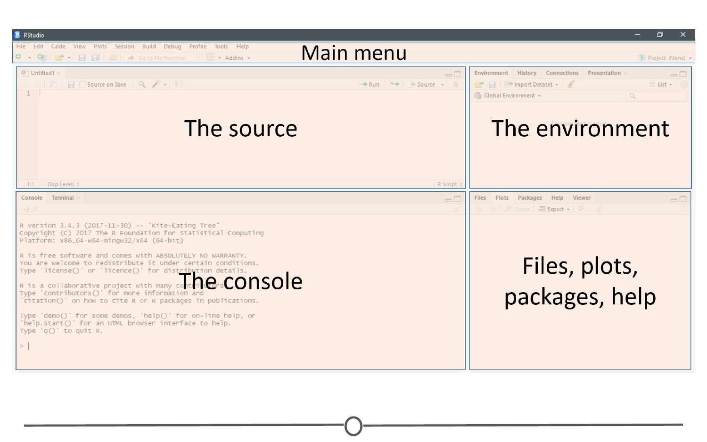
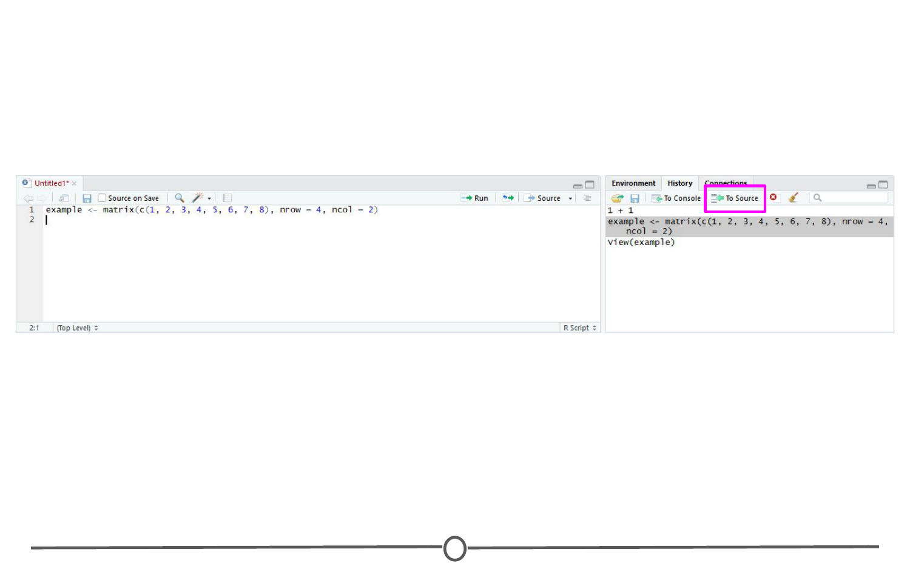
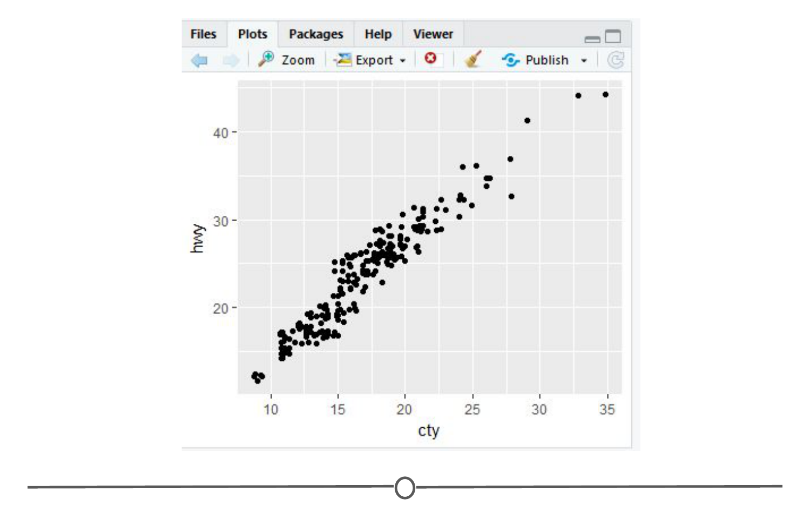
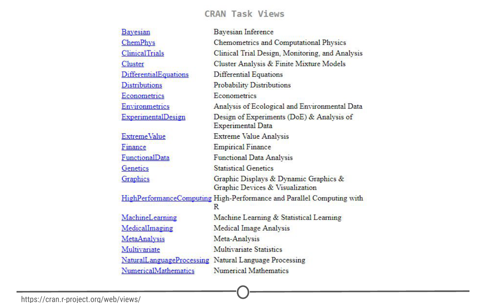
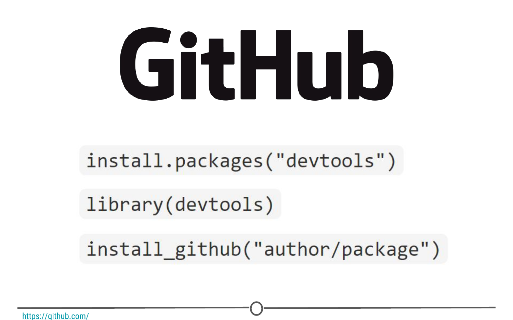
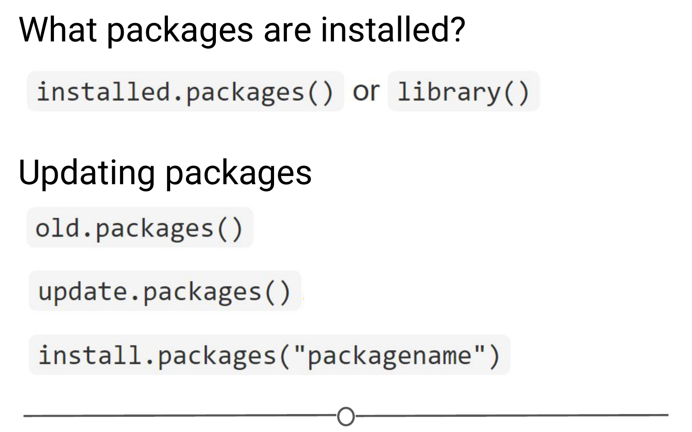

# Installing R

### What is R? What is CRAN?

First, let’s remind ourselves exactly what R is and why we might want to use it.

R is both a programming language and an environment, focused mainly on statistical analysis and graphics. It will be one of the main tools you use in this and following courses.

R is downloaded from the Comprehensive R Archive Network, or CRAN, and while this might be your first brush with it, we will be returning to CRAN time and time again, when we install packages - so keep an eye out!

### Why should you use R?

The reasons for using R are myriad, but some big ones are:

**1) Its popularity**

R is quickly becoming the standard language for statistical analysis. This makes R a great language to learn as the more popular a software is, the quicker new functionality is developed, the more powerful it becomes, and the better the support there is! Additionally, as you can see in the graph below, knowing R is one of the top five languages asked for in data scientist job postings!

**2) Its cost**

FREE!

This one is pretty self-explanatory - every aspect of R is free to use, unlike some other stats packages you may have heard of (eg: SAS, SPSS), so there is no cost barrier to using R!

**3) Its extensive functionality**

R is a very versatile language - we’ve talked about its use in stats and in graphing, but its use can be expanded to many different functions - from making websites, making maps using GIS data, analysing language… and even making these lectures and videos! For whatever task you have in mind, there is often a package available for download that does exactly that!

**4) Its community**

And the reason that the functionality of R is so extensive is the community that has been built around R. Individuals have come together to make “packages” that add to the functionality of R - and more are being developed every day!

Particularly for people just getting started out with R, its community is a huge benefit - due to its popularity, there are multiple forums that have pages and pages dedicated to solving R problems. We talked about this in the Getting Help lesson; these forums are great both for finding other people who have had the same problem as you, and posting your own new problems.

### Installing R

Now that we’ve spent some time looking at the benefits of R, it is time to install it! We’ll go over installation for both Windows and Mac below, but know that these are general guidelines and small details are likely to change subsequent to the making of this lecture - use this as a scaffold.

For both Windows and Mac machines, we start at the CRAN homepage: https://cran.r-project.org/

### Installation - for Windows

If you are on a Windows computer, follow the link Download R for Windows, and follow the directions there - if this is your first time installing R, go to the base distribution and click on the link at the top of the page that should say something like “Download R [version number] for Windows.” This will download an executable file for installation.

Open the executable, and if prompted by a security warning, allow it to run. Select the language you prefer during installation and agree to the licensing information. You will next be prompted for a destination location - this will likely be defaulted to Program Files, in a subfolder called R, followed by another directory of the version number. Unless you have any issues with this, the default location is perfect.

You will then be prompted to select which components should be installed. Unless you are running short on memory, installing all of the components is desireable. Next you’ll be asked about startup options, and again, the defaults are fine for this. You will then be asked where Setup should place shortcuts - this is completely up to you, you can allow it to add the program to the start menu, or you can click the box at the bottom that says to not create a start menu link. Finally, you will be asked whether you want a desktop or Quick Launch icon - up to you! I do not recommend changing the defaults for the registry entries though.

After this window, the installation should begin. Test that the installation worked by opening R for the first time!

### Installation - for Macs

If you are on a Mac computer, follow the link Download R for (Mac) OS X. There you can find the various R versions for download. Note: If your Mac is older than OS X 10.6 (“Snow Leopard”), you will need to follow the directions on this page for downloading older versions of R that are compatible with those operating systems.

Click on the link to the most recent version of R, which will download a .pkg file.

Open the pkg file and follow the prompts as provided by the installer. First, click continue on the welcome page and again on the important information window page. Next you will be presented with the software license agreement, again, continue. Next you may be asked to select a destination for R, either available to all users or to a specific disk - select whichever you feel is best suited to your setup. Finally, you will be at the “Standard Install” page; R selects a default directory and if you are happy with that location, go ahead and click install. At this point, you may be prompted to type in the admin password, do so, and the install will begin!

Once the installation is finished, go to your Applications and find R. Test that the installation worked by opening R for the first time!

### Summary

In this lesson we first looked at what R is and why we might want to use it. We then focused on the installation process for R on both Windows and Mac computers. 

# Installing RStudio

We’ve installed R and can open the R interface to input code, but there are other ways to interface with R - and one of those ways is using RStudio. In this lesson, we’ll get RStudio installed on your computer.

### What is RStudio?
RStudio is a graphical user interface for R, that allows you to write, edit and store code, generate, view and store plots, manage files, objects and dataframes, and integrate with version control systems – to name a few of its functions. We will be exploring exactly what RStudio can do for you in future lessons, but for anybody just starting out with R coding, the visual nature of this program as an interface for R is a huge benefit.

### Installing RStudio
Thankfully, installation of RStudio is fairly straightforward. First, you go to the RStudio download page. We want to download the RStudio Desktop version of the software, so click on the appropriate “Download” , under that heading and you will see a list of “Installers for supported platforms”.

At this point the installation process diverges for Macs and Windows, so follow the instructions for the appropriate OS.

### Installing RStudio - Windows

For Windows, select the RStudio installer for the various Windows editions (Vista, 7, 8, 10). This will initiate the download process. When the download is complete, open this executable file to access the installation wizard. You may be presented with a security warning at this time - allow it to make changes to your computer.

Following this, the installation wizard will open. Following the defaults on each of the windows of the wizard is appropriate for installation. In brief, on the welcome screen, click next. If you want RStudio installed elsewhere, “Browse” through your file system. Otherwise, it will likely default to the “Program Files” folder - this is appropriate. Click next. On this final page, allow RStudio to create a Start menu shortcut. Click Install. RStudio is now being installed. Wait for this process to finish; RStudio is now installed on your computer. Click Finish.

Check that RStudio is working appropriately by opening it from your Start menu.

### Installing RStudio - Macs

For Macs, select the Macs OS X RStudio installer (Mac OS X 10.6+ (64-bit)). This will initiate the download process. When the download is complete, click on the downloaded file and it will begin to install. When this is finished, the applications window will open. Drag the RStudio icon into the Applications directory. Test the installation by opening your applications folder and opening the RStudio software.

### Summary
In this lesson we installed RStudio, both for Macs and for Windows computers.

# RStudio Tour

Now that we have RStudio installed, we should familiarize ourselves with the various components and functionality of it! RStudio provides a cheatsheet of the RStudio environment - warning: this link initiates a download of a PDF from the RStudio GitHub.

### The various quadrants

Rstudio can be roughly divided into four quadrants, each with specific and varied functions, plus a main menu bar. When you first open RStudio, you should see a window that looks roughly like this:

You may be missing the upper left quadrant and instead have the left side of the screen with just one region, “Console” - if this is the case, go to File > New File > R Script and now it should more closely resemble the image. You can change the sizes of each of the various quadrants by hovering your mouse over the spaces between quadrants and click-dragging the divider to resize the sections.

We will go through each of the regions and describe some of their main functions. It would be impossible to cover everything that RStudio can do, so we urge you to explore RStudio on your own too!

### The menu bar

The menu bar runs across the top of your screen and should have two rows. The first row should be a fairly standard menu, starting with “File” and “Edit.” Below that, there is a row of icons that are shortcuts for functions that you’ll frequently use.

To start, let’s explore the main sections of the menu bar that you will use. The first being the File menu. Here we can open new or saved files, open new or saved projects (we’ll have an entire lesson in the future about R Projects, so stay tuned!), save our current document or close RStudio. If you mouse over “New File”, a new menu will appear that suggests the various file formats available to you. R Script and R Markdown files are the most common file types for use, but you can also generate R notebooks, web apps, websites, or slide presentations. If you click on any one of these, a new tab in the “Source” quadrant will open. We’ll spend more time in a future lesson on R Markdown files and their use.

The Session menu has some R specific functions, in which you can restart, interrupt or terminate R - these can be helpful if R isn’t behaving or is stuck and you want to stop what it is doing and start from scratch.

The Tools menu is a treasure trove of functions for you to explore. For now, you should know that this is where you can go to install new packages (see next lecture), set up your version control software (see future lesson: Linking GitHub and RStudio), and set your options and preferences for how RStudio looks and functions. For now, we will leave this alone, but be sure to explore these menus on your own once you have a bit more experience with RStudio and see what you can change to best suit your preferences!

### The console

This region should look familiar to you - when you opened R, you were presented with the console. This is where you type and execute commands, and where the output of said command is displayed.

To execute your first command, try typing 1 + 1 then enter at the > prompt. You should see the output [1] 2 below your command.

Now copy and paste the following into your console and hit enter.

example <- matrix(c(1, 2, 3, 4, 5, 6, 7, 8), nrow = 4, ncol = 2)

This creates a matrix with four rows and two columns, with the numbers 1 through 8.

### The environment/history

To view this matrix, first look to the Environment quadrant, where you should see the following:

Click anywhere on the “example” line, and a new tab on the Source quadrant should appear, showing the matrix you created. Any dataframe or matrix that you create in R can be viewed this way in RStudio.

RStudio also tells you some information about the object in the environment, like whether it is a list or a dataframe or if it contains numbers, integers or characters. This is very helpful information to have as some functions only work with certain classes of data. And knowing what kind of data you have is the first step to that.

The quadrant has two other tabs running across the top of it. We’ll just look at the History tab now. Your history tab should look something like this:

Here you will see the commands that we have run in this session of R. If you click on any one of them, you can click “To Console” or “To Source” and this will either rerun the command in the console, or will move the command to the source, respectively. Do so now for your example matrix and send it to Source.

### The source/The script editor panel

The Source panel is where you will be spending most of your time in RStudio. This is where you store the R commands that you want to save for later, either as a record of what you did or as a way to rerun code. We’ll spend a lot of time in this quadrant when we discuss R Markdown, but for now, click the save icon along the top of this quadrant and save the script as my_first_R_script.R Now you will always have a record of creating this matrix.

### Files/help/plots/packages panel

The final region we’ll look at occupies the bottom right of the RStudio window. In this quadrant, five tabs run across the top: Files, Plots, Packages, Help, and Viewer.

In Files, you can see all of the files in your current working directory. If this isn’t where you want to save or retrieve files from, you can also change the current working directory in this tab using the ellipsis at the far right, finding the desired folder, and then under the “More” cogwheel, setting this new folder as the working directory.

In the Plots tab, if you generate a plot with your code, it will appear here. You can use the arrows to navigate to previously generated plots. The Zoom function will open the plot in a new window, that is much larger than the quadrant. Export is how you save the plot. You can either save it as an image or as a PDF. The broom icon clears all plots from memory.

The Packages tab will be explored more in depth in the next lesson on R packages. Here you can see all the packages you have installed, load and unload these packages, and update them.

The Help tab is where you find the documentation for your R packages and various functions. In the upper right of this panel there is a search function for when you have a specific function or package in question.

### Summary
In this lesson we took a tour of the RStudio software. We became familiar with the main menu and its various menus. We looked at the Console, where R code is input and run. We then moved on to the Environment panel that lists all of the objects that have been created within an R session and allows you to view these objects in a new tab in Source. In this same quadrant, there is a History tab, that keeps a record of all commands that have been run. It also presents the option to either rerun the command in the Console, or send the command to Source, to be saved. Source is where you save your R commands. And the bottom right quadrant contains a listing of all the files in your working directory, displays generated plots, lists your installed packages, and supplies help files for when you need some assistance! Take some time to explore RStudio on your own!

# R packages

Now that we’ve installed R and RStudio and have a basic understanding of how they work together, we can get at what makes R so special: packages.

### What is an R package?

So far, anything we’ve played around with in R uses the “base” R system. Base R, or everything included in R when you download it, has rather basic functionality for statistics and plotting but it can sometimes be limiting. To expand upon R’s basic functionality, people have developed packages. A package is a collection of functions, data, and code conveniently provided in a nice, complete format for you. At the time of writing, there are just over 14,300 packages available to download - each with their own specialized functions and code, all for some different purpose. For a really in depth look at R Packages (what they are, how to develop them), check out Hadley Wickham’s book from O’Reilly, [“R Packages.”](http://r-pkgs.had.co.nz/)

Side note: A package is not to be confused with a library (these two terms are often conflated in colloquial speech about R). A library is the place where the package is located on your computer. To think of an analogy, a library is, well, a library… and a package is a book within the library. The library is where the books/packages are located.

Packages are what make R so unique. Not only does base R have some great functionality but these packages greatly expand its functionality. And perhaps most special of all, each package is developed and published by the R community at large and deposited in repositories.

### What are repositories?

A repository is a central location where many developed packages are located and available for download.

There are three big repositories:

- [CRAN (Comprehensive R Archive Network)](https://cran.r-project.org/web/packages/): R’s main repository (>12,100 packages available!)
- [BioConductor](https://bioconductor.org/packages/release/BiocViews.html#___Software): A repository mainly for bioinformatic-focused packages
- [GitHub](https://github.com/collections): A very popular, open source repository (not R specific!)

### How do you know what package is right for you?

So you know where to find packages… but there are so many of them, how can you find a package that will do what you are trying to do in R? There are a few different avenues for exploring packages.

First, CRAN groups all of its packages by their functionality/topic into 35 “themes.” It calls this its [“Task view.”](https://cran.r-project.org/web/views/) This at least allows you to narrow the packages you can look through to a topic relevant to your interests.

Second, there is a great website, [RDocumentation](https://www.rdocumentation.org/), which is a search engine for packages and functions from CRAN, BioConductor, and GitHub (ie: the big three repositories). If you have a task in mind, this is a great way to search for specific packages to help you accomplish that task! It also has a [“task view"](https://www.rdocumentation.org/taskviews) like CRAN, that allows you to browse themes.

More often, if you have a specific task in mind, Googling that task followed by “R package” is a great place to start! From there, looking at tutorials, vignettes, and forums for people already doing what you want to do is a great way to find relevant packages.

### How do you install packages?

Great! You’ve found a package you want… How do you install it?

**Installing from CRAN**

If you are installing from the CRAN repository, use the *install.packages()* function, with the name of the package you want to install in quotes between the parentheses (note: you can use either single or double quotes). For example, if you want to install the package “ggplot2”, you would use: *install.packages("ggplot2")*

Try doing so in your R console! This command downloads the “ggplot2” package from CRAN and installs it onto your computer.

If you want to install multiple packages at once, you can do so by using a character vector, like: *install.packages(c("ggplot2", "devtools", "lme4"))*

If you want to use RStudio’s graphical interface to install packages, go to the Tools menu, and the first option should be “Install packages…” If installing from CRAN, select it as the repository and type the desired packages in the appropriate box.

**Installing from Bioconductor**

The BioConductor repository uses their own method to [install packages.[(https://www.bioconductor.org/install/) First, to get the basic functions required to install through BioConductor, use: *source("https://bioconductor.org/biocLite.R")*

This makes the main install function of BioConductor, *biocLite()*, available to you. Following this, you call the package you want to install in quotes, between the parentheses of the biocLite command, like so: *biocLite("GenomicFeatures")*

**Installing from GitHub**

This is a more specific case that you probably won’t run into too often. In the event you want to do this, you first must find the package you want on GitHub and take note of both the package name AND the author of the package. Check out [this guide](http://kbroman.org/pkg_primer/pages/github.html) for installing from GitHub, but the general workflow is:

- install.packages("devtools") - only run this if you don’t already have devtools installed. If you’ve been following along with this lesson, you may have installed it when we were practicing installations using the R console
- library(devtools) - more on what this command is doing immediately below this
- install_github("author/package") replacing “author” and “package” with their GitHub username and the name of the package.

### Loading packages

Installing a package does not make its functions immediately available to you. First you must load the package into R; to do so, use the library() function. Think of this like any other software you install on your computer. Just because you’ve installed a program, doesn’t mean it’s automatically running - you have to open the program. Same with R. You’ve installed it, but now you have to “open” it. For example, to “open” the “ggplot2” package, you would run:library(ggplot2)

**NOTE:** Do not put the package name in quotes! Unlike when you are installing the packages, the library() command does not accept package names in quotes!

There is an order to loading packages - some packages require other packages to be loaded first (dependencies). That package’s manual/help pages will help you out in finding that order, if they are picky.

If you want to load a package using the RStudio interface, in the lower right quadrant there is a tab called “Packages” that lists out all of the packages and a brief description, as well as the version number, of all of the packages you have installed. To load a package just click on the checkbox beside the package name

### Updating, removing, unloading packages

Once you’ve got a package, there are a few things you might need to know how to do:

- Checking what packages you have installed

If you aren’t sure if you’ve already installed a package, or want to check what packages are installed, you can use either of: installed.packages() or library() with nothing between the parentheses to check!

In RStudio, that package tab introduced earlier is another way to look at all of the packages you have installed.

- Updating packages

You can check what packages need an update with a call to the function old.packages() This will identify all packages that have been updated since you installed them/last updated them.

To update all packages, use update.packages(). If you only want to update a specific package, just use once again install.packages("packagename")

Within the RStudio interface, still in that Packages tab, you can click “Update,” which will list all of the packages that are not up to date. It gives you the option to update all of your packages, or allows you to select specific packages.

You will want to periodically check in on your packages and check if you’ve fallen out of date - be careful though! Sometimes an update can change the functionality of certain functions, so if you re-run some old code, the command may be changed or perhaps even outright gone and you will need to update your code too!

- Unloading packages

Sometimes you want to unload a package in the middle of a script - the package you have loaded may not play nicely with another package you want to use.

To unload a given package you can use the detach() function. For example, detach("package:ggplot2", unload=TRUE) would unload the ggplot2 package (that we loaded earlier). Within the RStudio interface, in the Packages tab, you can simply unload a package by unchecking the box beside the package name.

- Uninstalling packages

If you no longer want to have a package installed, you can simply uninstall it using the function remove.packages(). For example, remove.packages("ggplot2")

(Try that, but then actually re-install the ggplot2 package - it’s a super useful plotting package!)

Within RStudio, in the Packages tab, clicking on the “X” at the end of a package’s row will uninstall that package.

**Sidenote: How do you know what version of R you have?**

Sometimes, when you are looking at a package that you might want to install, you will see that it requires a certain version of R to run. To know if you can use that package, you need to know what version of R you are running!

One way to know your R version is to check when you first open R/RStudio - the first thing it outputs in the console tells you what version of R is currently running. If you didn’t pay attention at the beginning, you can type version into the console and it will output information on the R version you are running. Another helpful command is sessionInfo() - it will tell you what version of R you are running along with a listing of all of the packages you have loaded. The output of this command is a great detail to include when posting a question to forums - it tells potential helpers a lot of information about your OS, R, and the packages (plus their version numbers!) that you are using.

### Using the commands in a function

In all of this information about packages, we haven’t actually discussed how to use a package’s functions!

First, you need to know what functions are included within a package. To do this, you can look at the man/help pages included in all (well-made) packages. In the console, you can use the help() function to access a package’s help files. Try help(package = "ggplot2") and you will see all of the many functions that ggplot2 provides. Within the RStudio interface, you can access the help files through the Packages tab (again) - clicking on any package name should open up the associated help files in the “Help” tab, found in that same quadrant, beside the Packages tab. Clicking on any one of these help pages will take you to that functions help page, that tells you what that function is for and how to use it.

Once you know what function within a package you want to use, you simply call it in the console like any other function we’ve been using throughout this lesson. Once a package has been loaded, it is as if it were a part of the base R functionality.

If you still have questions about what functions within a package are right for you or how to use them, many packages include “vignettes.” These are extended help files, that include an overview of the package and its functions, but often they go the extra mile and include detailed examples of how to use the functions in plain words that you can follow along with to see how to use the package. To see the vignettes included in a package, you can use the browseVignettes() function. For example, let’s look at the vignettes included in ggplot2:browseVignettes("ggplot2") . You should see that there are two included vignettes: “Extending ggplot2” and “Aesthetic specifications.” Exploring the Aesthetic specifications vignette is a great example of how vignettes can be helpful, clear instructions on how to use the included functions.

### Summary

In this lesson, we’ve explored R packages in depth. We examined what a packages is (and how it differs from a library), what repositories are, and how to find a package relevant to your interests. We investigated all aspects of how packages work: how to install them (from the various repositories), how to load them, how to check which packages are installed, and how to update, uninstall, and unload packages. We took a small detour and looked at how to check what version of R you have, which is often an important detail to know when installing packages. And finally, we spent some time learning how to explore help files and vignettes, which often give you a good idea of how to use a package and all of its functions.

If you still want to learn more about R packages, here are two great resources! [R Packages: A Beginner’s Guide](https://www.datacamp.com/community/tutorials/r-packages-guide) from Adolfo Álvarez on DataCamp and a lesson from the University of Washington, on an [Introduction to R Packages](http://faculty.washington.edu/kenrice/rintro/sess08.pdf) from Ken Rice and Timothy Thornton.
